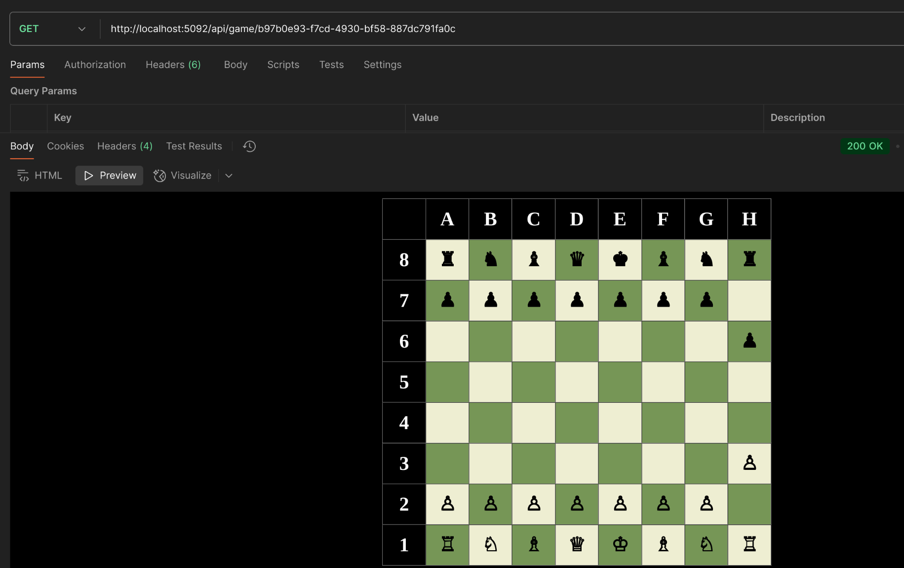

# HTTP Chess API ♜

A lightweight **ASP.NET Core Web API** for playing chess via HTTP requests.

🚨 **Note:** This is a demo used in the [Codando Live](http://codando.live) course.  
There is **no chess rules validation**—players can move pieces freely.  
💡 A great coding exercise is to implement **proper validation** based on chess rules.

> **Hosted on Azure Free Tier** ✅

## 🏁 Start a New Game

### 🔹 Request

```http
GET https://http-chess-ckfyheevasetabez.westus-01.azurewebsites.net/api/game/new
```

* Response

  Returns a **unique Game ID**.

  * Example

  ```text
  3b8ac115-9807-472e-9ddd-b9d798657e90
  ```

---

## 🔍 View the Game Board

Retrieve the **current board state** using your **Game ID**.

* Request (GET)

  ```http
  https://http-chess-ckfyheevasetabez.westus-01.azurewebsites.net/api/game/{game_id}[/mode]
  ```

  >Replace `{game_id}` with your actual Game ID and `mode` can be text. The default is html

* Example returning as HTML

  ```http
  https://http-chess-ckfyheevasetabez.westus-01.azurewebsites.net/api/game/3b8ac115-9807-472e-9ddd-b9d798657e90
  ```

  * Response

    Returns a **chessboard representation** as HTML.

    

* Example returning as TEXT

  ```http
  https://http-chess-ckfyheevasetabez.westus-01.azurewebsites.net/api/game/3b8ac115-9807-472e-9ddd-b9d798657e90/text
  ```

  * Response

    ```text
      A  B C  D E  F G  H
    8 ♜ ♞ ♝ ♛ ♚ ♝ ♞ ♜ 
    7   ♟ ♟ ♟ ♟ ♟ ♟ ♟ 
    6 ♟               
    5                 
    4                 
    3                 
    2 ♙ ♙ ♙ ♙ ♙ ♙ ♙ ♙ 
    1 ♖ ♘ ♗ ♕ ♔ ♗ ♘ ♖ 
    ```

## ➡️ Make a Move

Move a piece by specifying the **origin** and **destination** (e.g., `A7A6`).

* Request (GET)

  ```http
  GET https://http-chess-ckfyheevasetabez.westus-01.azurewebsites.net/api/game/{game_id}/{move}[/{mode}]
  ```

  * Example returning as HTML

    ```http
    https://http-chess-ckfyheevasetabez.westus-01.azurewebsites.net/api/game/3b8ac115-9807-472e-9ddd-b9d798657e90/move/A7A6
    ```

  * Example returning as TEXT

    ```http
    https://http-chess-ckfyheevasetabez.westus-01.azurewebsites.net/api/game/3b8ac115-9807-472e-9ddd-b9d798657e90/move/A7A6/text
    ```

---

## 🗑️ Delete a Game

* Request (GET)

  ```http
  https://http-chess-ckfyheevasetabez.westus-01.azurewebsites.net/api/game/{game_id}/delete
  ```

  * Example

  ```http
  https://http-chess-ckfyheevasetabez.westus-01.azurewebsites.net/api/game/3b8ac115-9807-472e-9ddd-b9d798657e90/delete
  ```

---

## 🛠️ Next Steps: Implement Chess Rule Validation

Currently, the API allows **any move**, ignoring chess rules.  
Take on the challenge of **adding logic** to:

* ✅ **EnforceLegal move validation** (e.g., knights move in L-shape).  
* ✅ **Turn-based movement** (white moves first).  
* ✅ **Checkmate detection** (game-ending logic).  
* ✅ **Castling & en passant mechanics**.
* ✅ **Allow Undo operation**.

---

♕♔ **Enjoy and Happy Coding!** ♛♚
